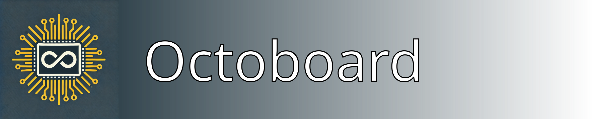
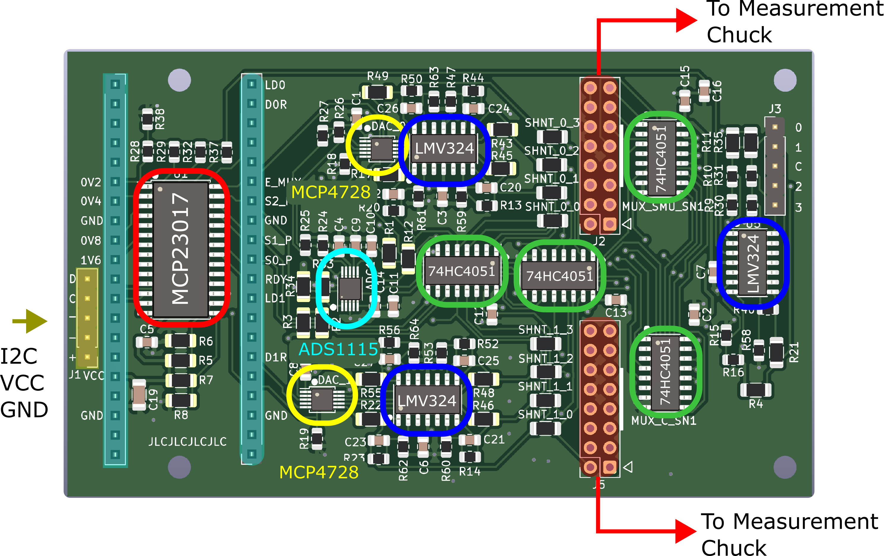
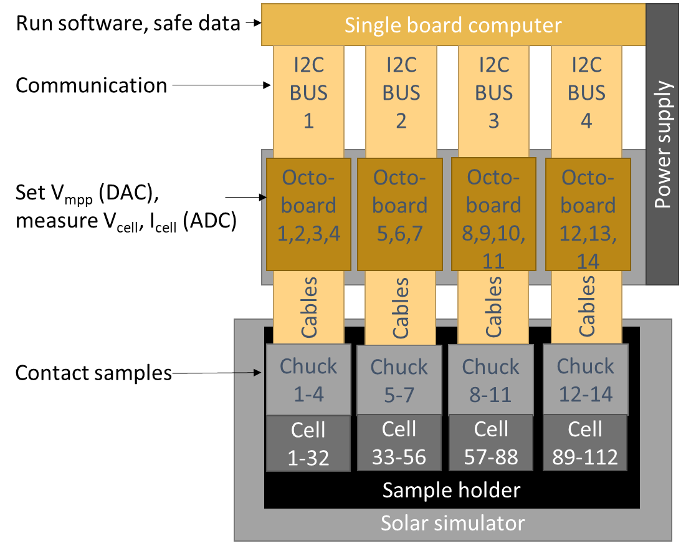

[](https://doi.org/10.5281/zenodo.14988205)

# Maximum Power Point Tracker for Research-Level Solar Cells

## Overview
This repository documents the design, implementation, and operation of a massively parallel, low-cost Maximum Power Point Tracker (MPPT) for aging and degradation studies of perovskite solar cells. The system integrates custom-designed PCBs and software for efficient tracking and data logging.

**NEW: v2.0 System** - Production-ready system supporting 3 Raspberry Pis with up to 288 channels (72 samples). Features include configurable IV sweep intervals (1-1000 minutes), automated file transfer, persistent state management, optimized web dashboard, and automatic hardware detection for scalable deployment!

## Features

### Hardware

**Octoboards** (`Custom-designed PCBs`) - Source Measure Unit (SMU) functions
- 8 channels per board
- Modular and scalable design
- Support for multiple boards via I2C addressing
- **Current System**: 12 boards per Raspberry Pi = 96 channels
- **Total Capacity**: 3 RPis × 96 channels = **288 channels**

**Measurement Chuck**
- Allows up to 10 substrates (40 solar cells on "University of Marburg" cell layout)
- Aged in nitrogen atmosphere
- Compact design optimized for standard solar simulators
- Easy sample replacement without breaking atmosphere

### Software v2.0

**Dual-System Architecture:**

1. **RPi System** (`rpi_system/`)
   - Python-based control for 96 channels per RPi
   - Hourly automated IV sweeps
   - Real-time file transfer to Main PC
   - RESTful API for remote control
   - Sample configuration management (24 samples × 4 pixels)
   - **Simulation Mode** for development without hardware

2. **Main PC System** (`main_pc_system/`)
   - **Streamlit Dashboard** - Web-based control interface
   - **File Receiver** - Automated data collection from RPis
   - Real-time monitoring of all 3 RPis
   - Data visualization (IV curves, power curves)
   - Sample management and assignment
   - Data browser with file listings

**Key Capabilities:**
- ✅ 288 channels total (72 samples, 4 pixels each)
- ✅ Configurable IV sweep intervals (1-1000 minutes per sample)
- ✅ Automatic hardware detection (supports 1-12 Octoboards per RPi)
- ✅ Persistent state management via status files
- ✅ Optimized dashboard with pagination for 288+ channels
- ✅ Production-ready deployment with systemd service
- ✅ Comprehensive beginner's guide for Raspberry Pi setup
- ✅ Hourly IV sweep generation (1 file per channel)
- ✅ Automatic LAN-based file transfer
- ✅ Organized data storage: `SampleID/pixel/IV_timestamp.csv`
- ✅ Real-time dashboard monitoring
- ✅ Simulation mode for Windows development
- ✅ RESTful API control
- ✅ Multi-board management

### Integration
- Full Raspberry Pi compatibility (tested on RPi 4)
- Windows development support via simulation mode
- Network communication (LAN, no internet required)
- Modular and extensible architecture

## Repository Structure
```plaintext
├── docs/                                    # Documentation and images
├── hardware/                                # PCB designs and CAD files
│   ├── Measurement Chuck Housing CAD Design/
│   ├── Measurement Chuck PCB Design/
│   └── Octoboard PCB Design/
│   │   └── gerber.zip
│   ├── Octoboard PCB Design/
│   │   ├── DAC.kicad_sch
│   │   ├── octoboard.kicad_pcb
│   │   ├── octoboard.kicad_prl
│   │   ├── octoboard.kicad_pro
│   │   └── octoboard.kicad_sch
├── software/
│   ├── hardware/
│   │   ├── __init__.py
│   │   ├── channel.py
│   │   ├── constants.py
│   │   ├── i2c.py
│   │   ├── manager.py
│   │   ├── oboard.py
│   │   └── sdac.py
│   ├── tests/
│   │   ├── test_hardware.py
│   │   ├── test_logger.py
│   │   └── test_tracker.py
│   ├── __init__.py
│   ├── cli.py
│   ├── logger.py
│   ├── requirements.txt
│   └── setup.py
└── README.md
```

## Documentation

### 1. Hardware

#### **1.1 Octoboard**
The Octoboard is a custom-designed PCB that forms the core of the MPPT system, providing capabilities for maximum power point tracking in solar cell testing and evaluation.

**Key Components:**
- **MCP23017**: 16-bit I2C I/O expander for digital control
- **MCP4728**: 4-channel DAC for voltage control
- **ADS1115**: 16-bit ADC for precision measurement
- **LMV324**: Quad operational amplifiers for signal conditioning
- **74HC4051**: Analog multiplexers for efficient channel selection



#### Component Specifications

| Component | Type | Key Specifications | Datasheet |
|-----------|------|-------------------|-----------|
| MCP4728 | DAC | 12-bit, 4-channel, I2C | [Datasheet](http://ww1.microchip.com/downloads/en/devicedoc/22187e.pdf) |
| ADS1115 | ADC | 16-bit, 4-channel, I2C | [Datasheet](https://www.ti.com/lit/gpn/ads1115) |
| LMV324 | Op-Amp | Rail-to-rail, low power | [Datasheet](https://www.onsemi.com/download/data-sheet/pdf/lmv321-d.pdf) |
| 74HC4051 | Multiplexer | 8-channel analog | [Datasheet](https://assets.nexperia.com/documents/data-sheet/74HC_HCT4051.pdf) |
| MCP23017 | I/O Expander | 16-bit, I2C | [Datasheet](https://ww1.microchip.com/downloads/aemDocuments/documents/APID/ProductDocuments/DataSheets/MCP23017-Data-Sheet-DS20001952.pdf) |

#### System Architecture
The MPPT system is designed with a hierarchical structure:
1. Central Raspberry Pi controller
2. Multiple Octoboards (8 channels each)
3. I2C communication backbone
4. Integrated sample holder with thermal management



#### **1.2 Measurement Chuck**
The Measurement Chuck allows up to 10 substrates (40 solar cells on a "University of Marburg" cell layout) to be aged under a nitrogen atmosphere.
Due to its compact design, up to eight measurement chucks can be fit in a Solaronix SOLIXON A-45 solar simulator. 

**Operation & Handling**
To replace the substrates inside a chuck:
1. Disconnect the flat ribbon cables and nitrogen supply hoses (quick-connect couplings ensure that the remaining substrates stay in an N₂ atmosphere).
2. Transfer the chuck to a glovebox, where the cells can be exchanged by loosening the screws as shown in the video below.
3. Reinsert the newly equipped chuck into the sun simulator and attach it to the cables and supply hoses. 

<div style="display: flex; justify-content: flex-start;">
    
</div>

### 2. Software v2.0

## Quick Start

### System Components

**1. Raspberry Pi System** (`rpi_system/`)
- Controls 96 channels (12 Octoboards)
- Runs hourly IV sweeps automatically
- Transfers data to Main PC via LAN
- RESTful API for remote control

**2. Main PC System** (`main_pc_system/`)
- Web dashboard (Streamlit) for control
- File receiver for automated data collection
- Real-time monitoring of all RPis
- Data visualization and analysis

### Installation & Setup

#### Main PC System

```powershell
cd main_pc_system
.\start.bat  # Automatic setup and launch
```

Opens:
- File Receiver at `http://192.168.1.100:8000`
- Dashboard at `http://localhost:8501`

#### Raspberry Pi System

```bash
cd rpi_system

# For actual hardware
python api_server.py

# For simulation/testing (Windows)
$env:OCTOBOARD_SIMULATION="True"
python api_server.py
```

### Complete Documentation

- **[Main PC System README](main_pc_system/README.md)** - Setup, API endpoints, usage
- **[RPi System README](rpi_system/README.md)** - Hardware control, configuration
- **[Testing Guide](TESTING_GUIDE.md)** - Complete end-to-end testing procedures
- **[Project Structure](PROJECT_STRUCTURE.md)** - System architecture overview

## System Capacity

| Metric | Value |
|--------|-------|
| Raspberry Pis | 3 |
| Octoboards per RPi | 12 |
| Channels per RPi | 96 |
| **Total Channels** | **288** |
| Samples per RPi | 24 (4 pixels each) |
| **Total Sample Capacity** | **72** |
| IV Sweep Frequency | Every 1 hour |
| Files Generated | 96 per hour per RPi |

## Network Configuration

| Device | IP Address | Port | Role |
|--------|-----------|------|------|
| Main PC | 192.168.1.100 | 8000 (Receiver) | Control center |
| Main PC | 192.168.1.100 | 8501 (Dashboard) | Web interface |
| RPi 1 | 192.168.1.101 | 8001 | Channels 0-95 |
| RPi 2 | 192.168.1.102 | 8001 | Channels 0-95 |
| RPi 3 | 192.168.1.103 | 8001 | Channels 0-95 |

## Data Flow

```
┌─────────────┐
│   RPi 1-3   │ ──► Hourly IV Sweeps (96 channels each)
│ (Octoboards)│       │
└─────────────┘       │
                      ▼
              ┌──────────────┐
              │  Generate    │ ──► 4 CSV files per sample
              │  IV Files    │       (pixels a, b, c, d)
              └──────────────┘
                      │
                      ▼
              ┌──────────────┐
              │  HTTP POST   │ ──► Transfer over LAN
              │  to Main PC  │
              └──────────────┘
                      │
                      ▼
         ┌────────────────────────┐
         │  Main PC File Receiver │
         │  Organizes & Stores    │
         └────────────────────────┘
                      │
                      ▼
    C:/OctoBoard_Data/
    └── SampleID/
        ├── a/
        │   └── IV_timestamp.csv
        ├── b/
        ├── c/
        └── d/
```

### 2. Software (Legacy)

#### Installation

1. Clone the repository:
```bash
git clone https://github.com/H2020DiamondEU/octoboard.git
cd octoboard
```

2. Install dependencies:
```bash
pip install -r software/requirements.txt
```

3. Install the package:
```bash
pip install -e .
```

#### Usage

1. Basic operation:
```python
from software import OBoardManager

# Initialize manager with I2C bus number
manager = OBoardManager(i2c_num=1)

# Start MPP tracking on all channels
manager.cycle_all_channels(iterations_per_channel=10)
```

2. Command-line interface:
```bash
python -m software.cli 1  # Start tracking on I2C bus 1
```

### 3. Data Management

Data is stored in CSV format with the following structure:
- Location: `data/[board_id]_channel_[n]_data.csv`
- Format: timestamp, voltage, current, power, temperature

### 4. Troubleshooting

Common issues and solutions:
1. I2C Communication Errors
   - Check bus number and device addresses
   - Verify cable connections
   - Check for address conflicts

2. Measurement Instability
   - Verify power supply stability
   - Check contact resistance

## License
This project is licensed under the MIT License. See `LICENSE` for details.

## Links
- [Project Website](https://diamond-horizon.eu/)
- [European Commission Project Page](https://cordis.europa.eu/project/id/101084124)
- [Deliverable Documentation](https://ec.europa.eu/research/participants/documents/downloadPublic?documentIds=080166e50d1470c5&appId=PPGMS)

## Contact
For further information on integrating this measurement system into your PV lab, please contact:
- **Lukas Wagner**, Physics of Solar Energy Conversion Group, Philipps-University Marburg, Germany.
- **Clemens Baretzky**, Fraunhofer Institute for Solar Energy Systems ISE, Germany.

<div style="display: flex; justify-content: flex-start;">
    
</div> 

## Acknowledgments
This design was developed at the **University of Marburg** and **Fraunhofer ISE**.
The project is funded by the European Union in the Horizon 2.5. Climate, Energy and Mobility programme under Grant Agreement No. 101084124. Views and opinions expressed are however those of the author(s) only and do not necessarily reflect those of the European Union. Neither the European Union nor the granting authority can be held responsible for them.

<div style="display: flex; justify-content: flex-start;">
    
</div>
